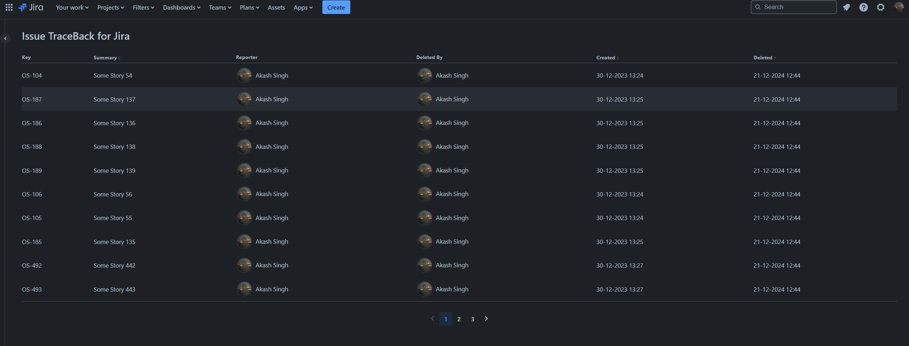

# Issue Traceback for Jira

This project contains a simple Forge app written in JavaScript that shows an audit log of all the Jira issues deleted in instance post installation in a Jira admin page. Some of the key modules utilized in the app include [Forge Storage - Custom Entity Store](https://developer.atlassian.com/platform/forge/storage-reference/storage-api-custom-entities/), [Jira Events triggers](https://developer.atlassian.com/platform/forge/events-reference/jira/) and [UI kit](https://developer.atlassian.com/platform/forge/ui-kit/components/) for frontend.

See [developer.atlassian.com/platform/forge/](https://developer.atlassian.com/platform/forge) for documentation and tutorials explaining Forge.

## Requirements

See [Set up Forge](https://developer.atlassian.com/platform/forge/set-up-forge/) for instructions to get set up.

## Quick start

- Modify your app frontend by editing the `src/frontend/index.jsx` file.

- Modify your app backend by editing the `src/resolvers/index.js` file to define resolver functions. See [Forge resolvers](https://developer.atlassian.com/platform/forge/runtime-reference/custom-ui-resolver/) for documentation on resolver functions.

- Register your app by running:

```
forge register
```

- Install npm dependencies for your app by running:

```
npm install
```

- Build and deploy your app by running:

```
forge deploy
```

- Install your app in an Atlassian site by running:

```
forge install
```

- Develop your app by running `forge tunnel` to proxy invocations locally:

```
forge tunnel
```

### Notes

- Use the `forge deploy` command when you want to persist code changes.
- Use the `forge install` command when you want to install the app on a new site.
- Once the app is installed on a site, the site picks up the new app changes you deploy without needing to rerun the install command.

### Usage

- Navigate to `App` -> `Manage your apps` from the top navigation bar in Jira
- Select **Issue TraceBack for Jira** from the side-navigation menu.
  
